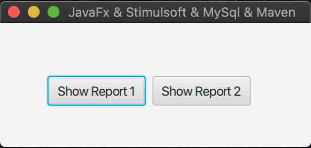
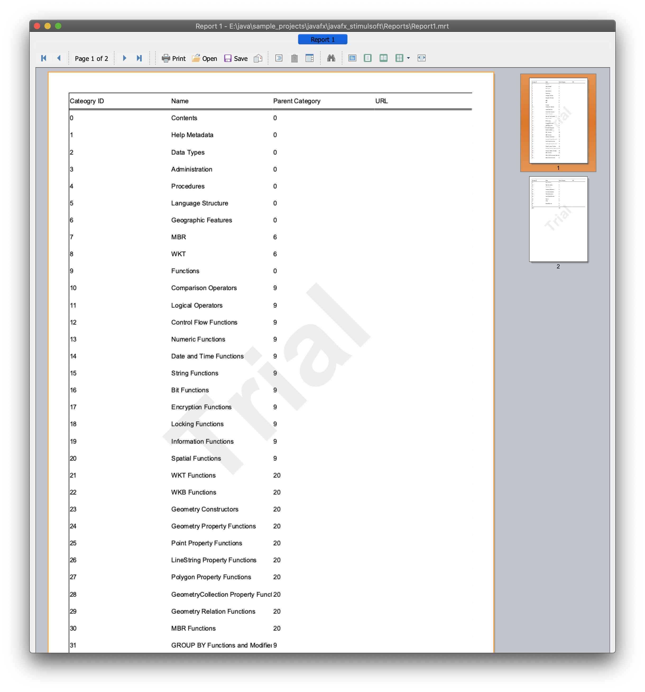
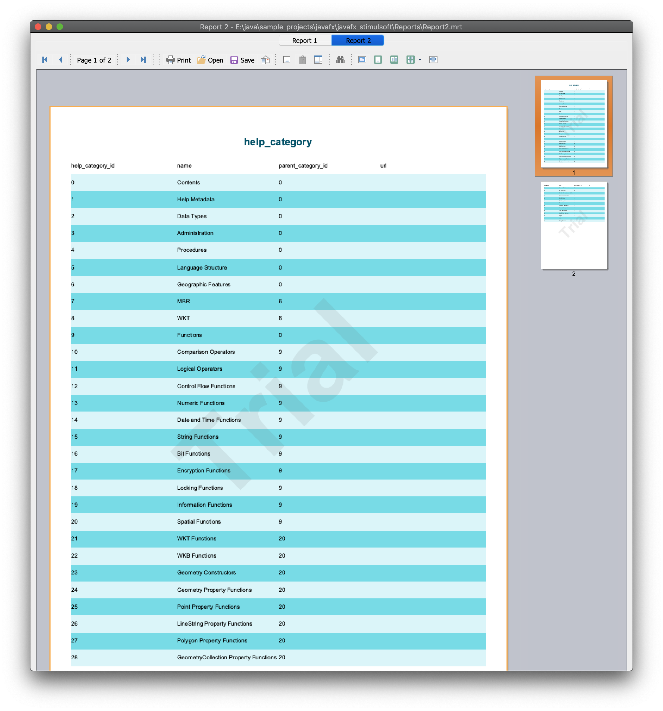

# java javafx stimulsoft mysql

This project demonstrates integration of [Stimulsoft Reporting tools](https://www.stimulsoft.com/en) with JavaFx.


### Tools/Frameworks:
- JDK 8
- Maven
- Stimulsoft Reporting
- JavaFx
- Swing
- MySQL 5.7
- Localization
- Lombok


### Customized Report Viewer
It also contains a Customized Report Viewer (ReportViewer class) with more controls based on Stimulsoft report viewer UI (StiViewerFx class).
With localization simplified feature, you can easily localize your report viewer. Two locale files are placed in Localization directory.
For supporting more languages just put your specific language file in this directory and send the name of it to ReportViewer class.


## How to compile & build
to being able to compile and build the project you need following prerequisites:
- JDK 8 [Download](https://www.oracle.com/java/technologies/javase/javase-jdk8-downloads.html)
- Maven [Download] (http://maven.apache.org/download.cgi)

```
cd /path/to/project/root/directory/
mvn clean package
```
_it creates the jar file: /path/to/project/root/directory/target/javafx_stimulsoft-1.0-SNAPSHOT.jar_


## How to run
- Install MySQL [Download](https://dev.mysql.com/downloads/mysql/)
- Set MySQL configuration in Main.java file:
  ```
    private static final String MYSQL_IP = "localhost";
    private static final int MYSQL_PORT = 3306;
    private static final String MYSQL_USER = "root";
    private static final String MYSQL_PASS = "951963";
  ```
- Copy following directories to the jar location:
  ```
    cp -r /path/to/project/root/directory/Localization /path/to/project/root/directory/target/
    cp -r /path/to/project/root/directory/Reports /path/to/project/root/directory/target/
  ```
- Run the jar file in terminal/cmd: `java -jar /path/to/project/root/directory/target/javafx_stimulsoft-1.0-SNAPSHOT.jar`


## How to set localization
Currently following locale supports:
  - English (en.xml)
  - Farsi (fa.xml)
The default locale is English (en). To switch between them pass locale name as argument to the jar file. e.g.:
`java -jar /path/to/project/root/directory/target/javafx_stimulsoft-1.0-SNAPSHOT.jar fa`


## Screenshots
- Main Page, template selection:

  
  
  
- Two sample templates:
  
  


# License
The contents of this repository are covered under the [MIT License](https://github.com/ghasemel/java-javafx-stimulsoft-mysql/blob/master/LICENSE).
